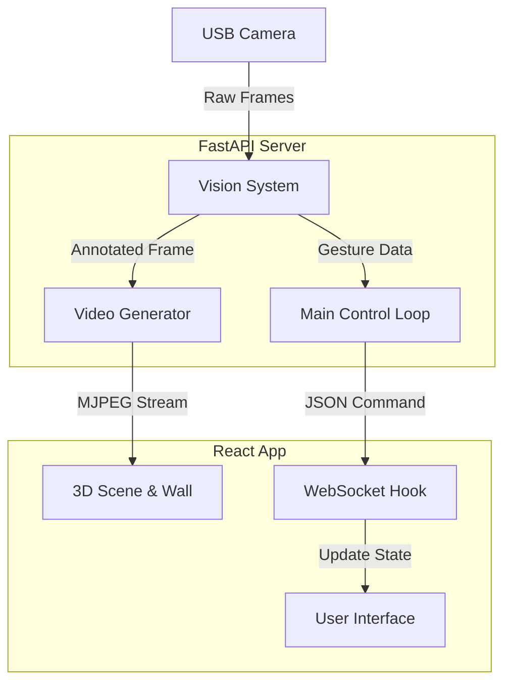

# r4: Robot Control Studio 🧠🤖

**r4** is a web-based digital twin and control interface for mobile robots. It combines real-time 3D visualization, immersive environment simulation, computer vision, and low-latency hardware control into a single "Command Center" dashboard.


*(Replace with actual screenshot)*

## 🌟 Key Features

### 🧠 AI & Computer Vision (New!)
-   **Hand Gesture Control**: Drive the robot just by moving your hand!
    -   ✊ **FIST**: Driver Mode (Move Forward/Back, Turn Left/Right).
    -   ✋ **PALM**: Lookout Mode (Pan/Tilt Camera).
-   **Real-time Visualization**: See what the robot "sees" (Skeleton Tracking & Target Vectors).

### 🖥️ 3D Digital Twin
-   **High-Fidelity Model**: Uses detailed STL exports from our CAD source (OpenSCAD) to render the robot with physically based materials.
-   **Real-Time Kinematics**: Visualizes differential drive movement and gimbal kinematics (Pan/Tilt) in real-time.

### 🏠 Immersive Environment
-   **Dynamic Room**: A fully configurable 3D workspace. Adjust width, depth, and height to match your real surroundings.
-   **"Magic Mirror" Wall**: The front wall renders your live **Webcam Feed** (Now powered by AI-enhanced MJPEG Stream).
-   **Smart Desk Bounds**: Drive your robot on a virtual desk setup with collision prevention.

### 🎮 Control Interface
-   **Dual Joystick Control**:
    -   **Left Stick**: Omnidirectional Drive (Velocity/Turn).
    -   **Right Stick**: Camera Gimbal (Pan/Tilt).
-   **Touch Optimized**: Works seamlessly on touchscreens or with mouse input.

---

## 🏗️ Architecture

The system follows a modern **Domain-Driven Architecture**:

### 1. Frontend (`web/src/features/`)
Built with **React**, **Vite**, and **React Three Fiber**.
-   **`robot/`**: Kinematics logic and 3D Model components.
-   **`environment/`**: Room, Desk, and Webcam Wall simulation.
-   **`controls/`**: Joysticks, HUD, and State Management.
-   **`hooks/`**: Custom hooks like `useRobotSocket` for robust Connection Management.

### 2. Backend (`api/app/`)
Built with **FastAPI** (Python).
-   **`services/vision.py`**: The Computer Vision Engine (MediaPipe + OpenCV).
-   **`main.py`**: The Central Brain. Handles WebSockets, Broadcasts AI Commands, and manages Hardware state.

### 3. System Diagram


---

## 🚀 Getting Started

### Prerequisites
-   **Node.js** (v18+)
-   **Python** (v3.10+)

### 1. Frontend Setup (The Studio)
```bash
cd web
npm install
npm run dev
# Open http://localhost:5173
```

### 2. Backend Setup (The Brain)
In a new terminal:
```bash
cd api
# Create/Activate Virtual Env (Recommended)
python -m venv venv
.\venv\Scripts\activate  # Windows

pip install -r requirements.txt
uvicorn app.main:app --reload
# Listening on http://localhost:8000
```

---

## 🕹️ Controls Guide

| Input | Action |
| :--- | :--- |
| **Left Joystick** | **Drive**: Push Up/Down for Speed, Left/Right for Turning. |
| **Right Joystick** | **Look**: Push Up/Down (Tilt), Left/Right (Pan). |
| **Hand Gestures** | **FIST**: Drive &nbsp;•&nbsp; **PALM**: Look |
| **Room Controls** | Use the **Leva Panel** (Top Right) to resize the room. |

---

## ⚙️ Configuration & Tuning

### 1. Sensitivity & Speed (`api/app/main.py`)
Adjust the scaling factors in `cv_loop` to change robot behavior:

| Variable | Value | Description |
| :--- | :--- | :--- |
| **Velocity** (`v`) | `vy * 500` | Max forward speed (mm/s). |
| **Turn** (`w`) | `vx * -1.5` | Turn sharpness. (Negative = Left is Left). |
| **Pan** | `vx * -90` | Max camera pan angle (degrees). |
| **Tilt** | `vy * 45` | Max camera tilt angle (degrees). |

### 2. Deadzone (`api/app/services/vision.py`)
Modify `deadzone = 0.20` in `_process_hand`.
*   **Higher (>0.2)**: More stable, harder to start moving.
*   **Lower (<0.1)**: More responsive, but "jitters" when holding still.

### 3. Camera Source
If you have multiple cameras, change `camera_index=0` in `vision.py` to `1` or `2`.

---

## 🔮 Roadmap

### Phase 1: Foundation & Hardware (In Progress)
- [x] **1. 2WD Differential Drive** (Joystick Logic & Control)
- [x] **2. 2-Axis Pan-Tilt Gimbal** (Look-then-Drive Logic)
- [x] **3. Live Cam Streaming** (MJPEG Integration)
- [ ] **4. Cliff Sensing** (4x IR Sensors)
- [ ] **5. Rear Obstacle Sensing** (Ultrasonic)

### Phase 2: Advanced AI
- [x] **1. Vision-to-Control** (Hand Gestures -> Proxy)
- [ ] **2. Voice Interaction** (WW / ASR / TTS)
- [ ] **3. Logic & Memory** (Small Language Models + RAG)
- [ ] **4. Personality** (Animated Face Emotions)
- [ ] **5. Professional Control** (ROS Integration)

---

*Project r4 - codebreakerd260*
